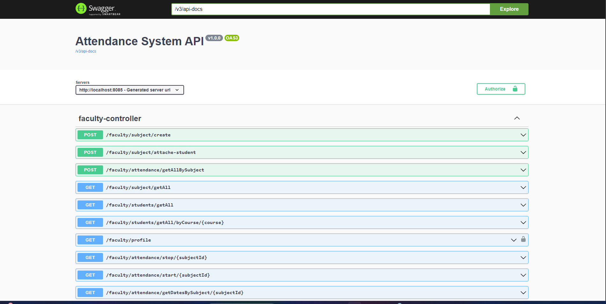
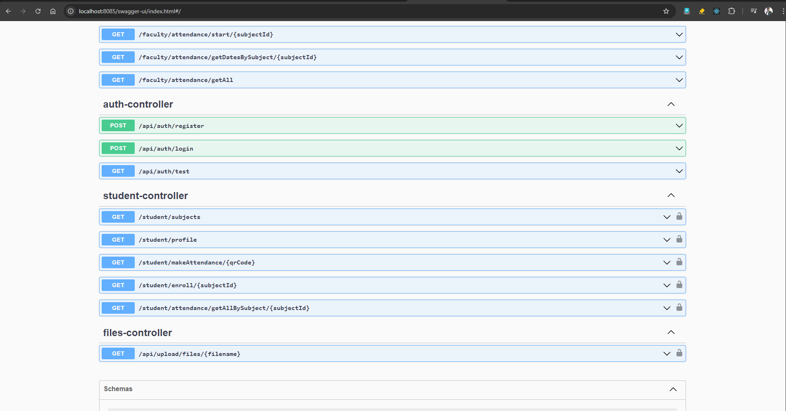

# College Attendance API

This api will help and manage college student attendance. Faculty and student can register using this api and monitor all attendance related tasks.
This api is comfortable with swagger openAPI docs. So if you want to create an app or website for frontend and integrate this api to it, you can easily do that.

I already created a `React Native` frontend application, so you can also check out that. 

### Features
- Full support of JWT Authentication.
- Swagger v3 Integrated for OpenAPI doc.
- Easily configurable.
- Headless API, So you can easily integrate with any frontend.

### Requirement
- MySQL Database
- Java 17
- Any Java IDE like IntelliJ, Eclipse or VSCode etc

### Installation
- Clone the repository
- Open it with any Java IDE
- In `application.properties` file add your database configuration.
- Finally, you can run the application.

### URL's For Reference
- Swagger [http://localhost:8085/swagger-ui/index.html](http://localhost:8085/swagger-ui/index.html)
- Faculty QR code Generator [http://localhost:8085/faculty](http://localhost:8085/faculty)
- Front End Android application build using React Native [satish358/Attendance-React-Native-App](https://github.com/satish358/attendance-react-native-app)

In above url's `8085` is `server.port` in your case might be change based on your configuration. So edit according.

### Screenshots

